- 🏫 대학교 기말 프로젝트: 우리 대학/학과 활성화 문제 해결(동적 웹페이지 크롤링 및 분석)
- 📅 진행 기간: 2025.12.4 ~ 2025.12.17

---

## 👨‍👩‍👧‍👦 구성원

| Name   | GitHub                                   |
| ------ | ---------------------------------------- |
| 금시언 | [@sieon](https://github.com/silversieon) |
| 이예빈 | [@yebin](https://github.com/shail1027)   |

---

## 📝 프로젝트 개요
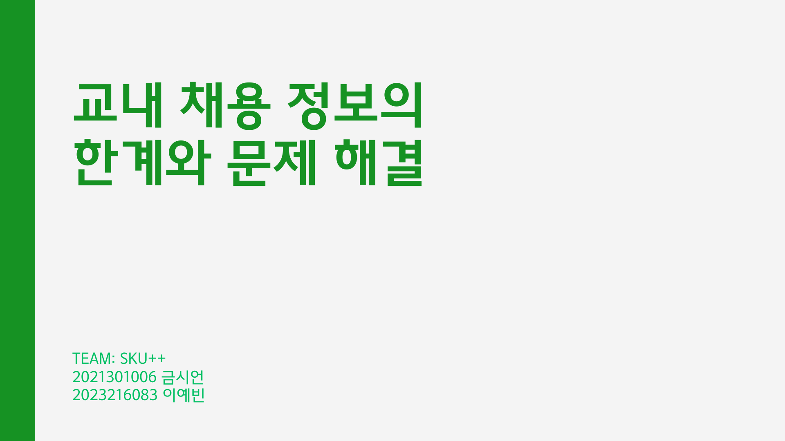
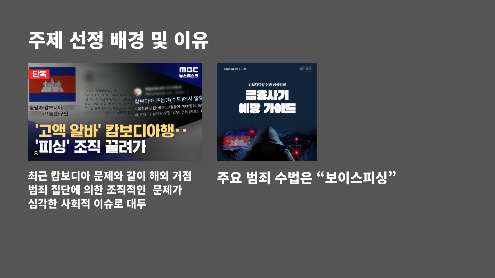

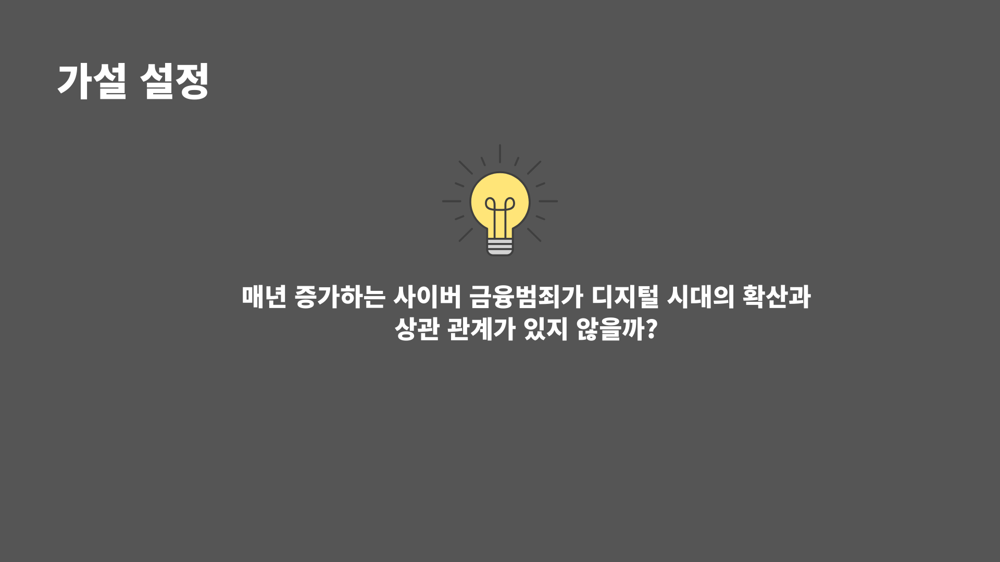

## 💡 아이디어 착안
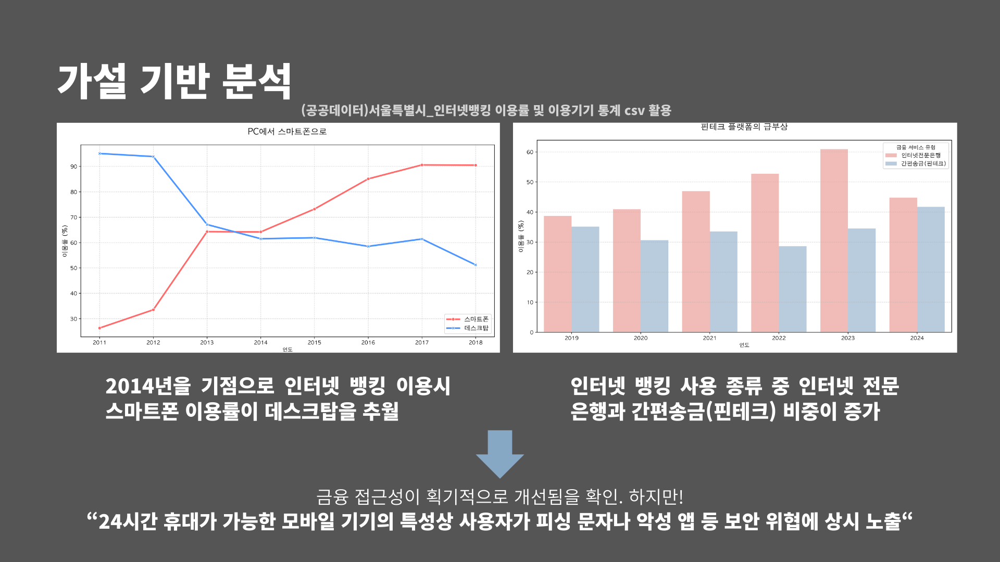
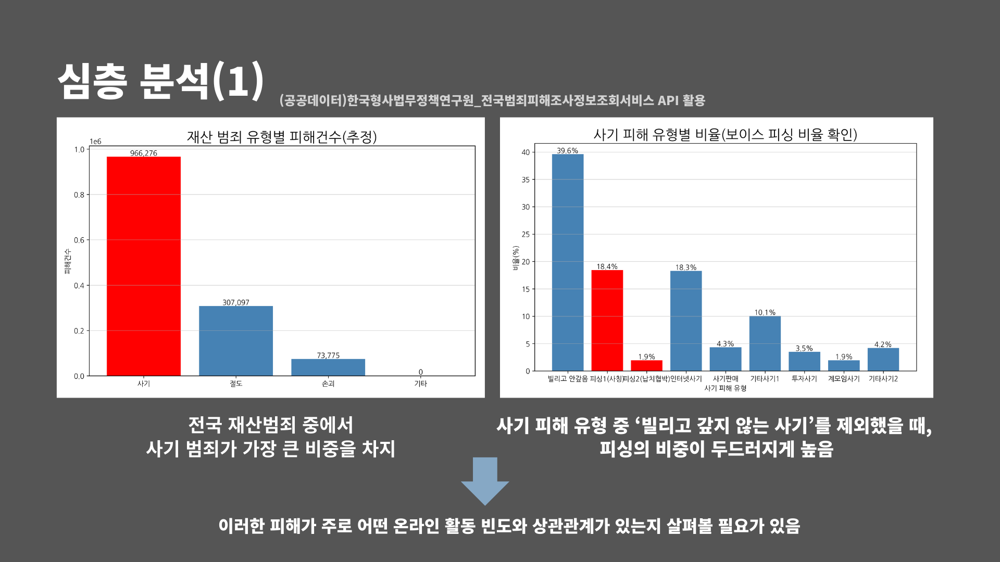
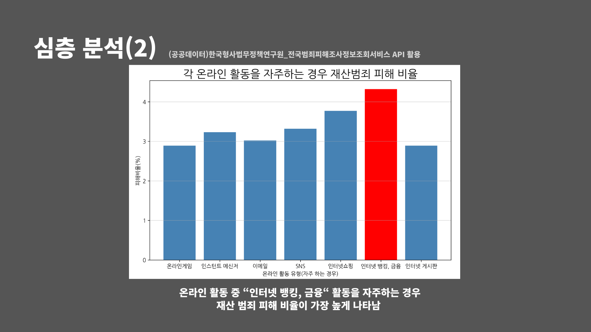
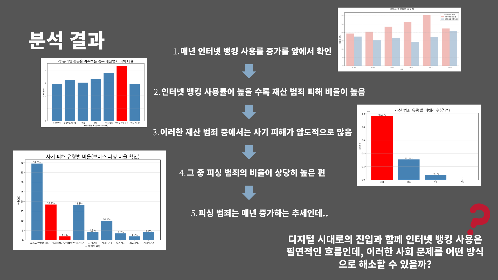

---

## 📈 주요 분석 과정
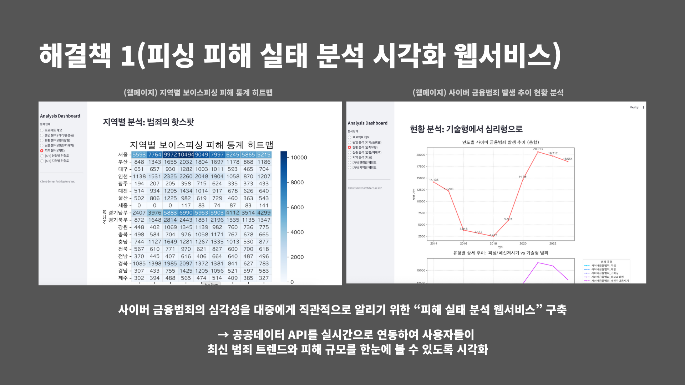
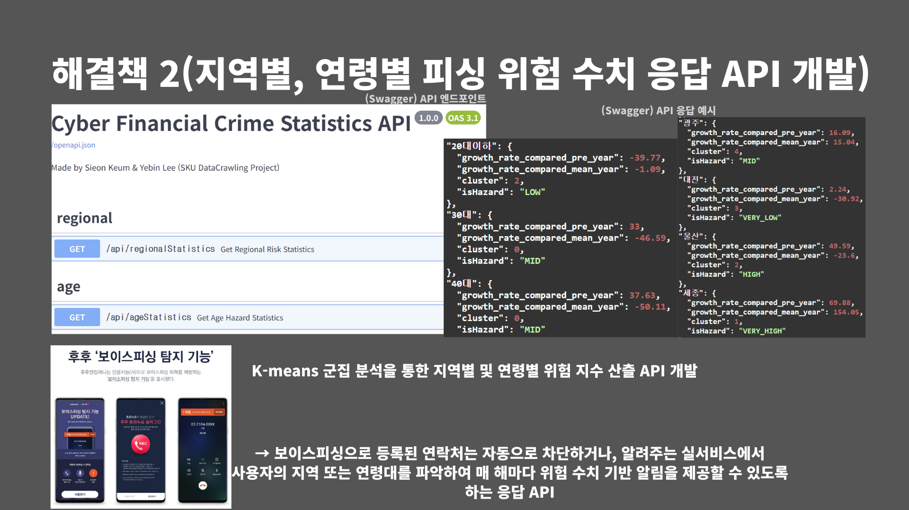
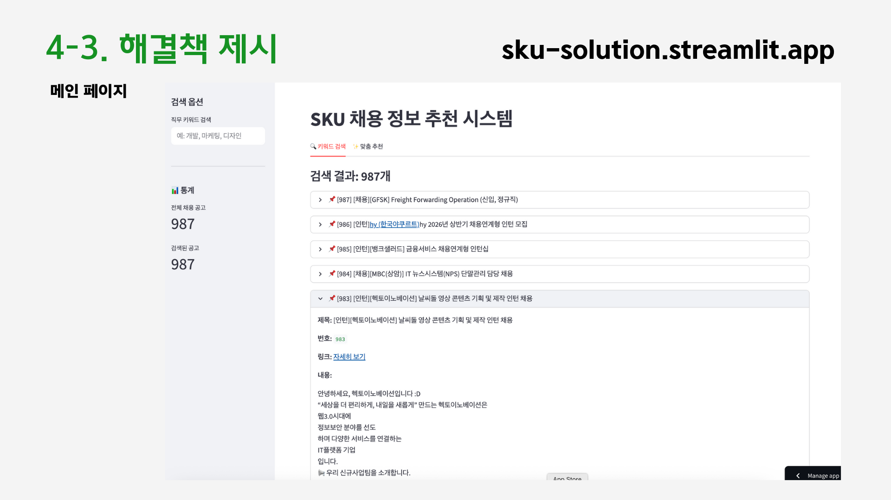
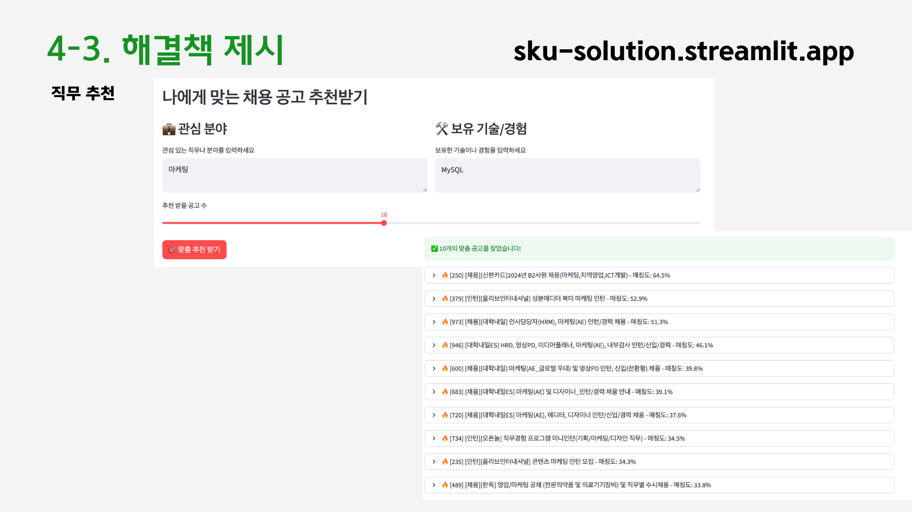

---

### ⚙️ 주요 기능(해결안)

---